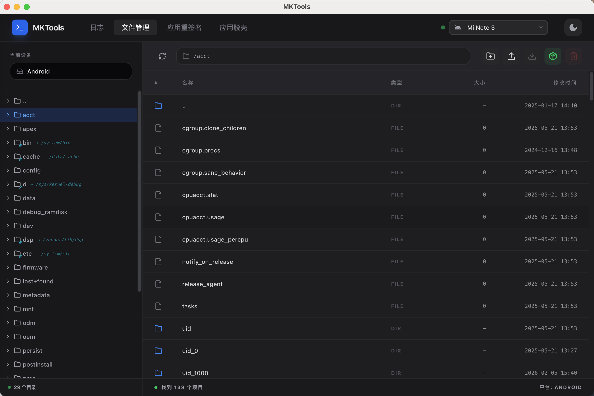
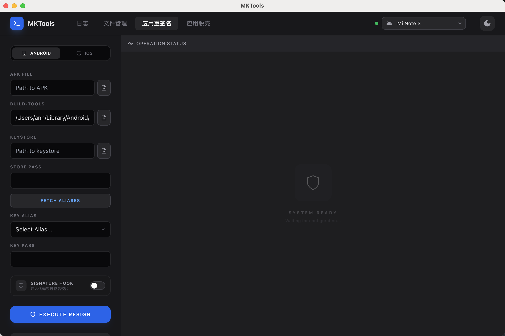
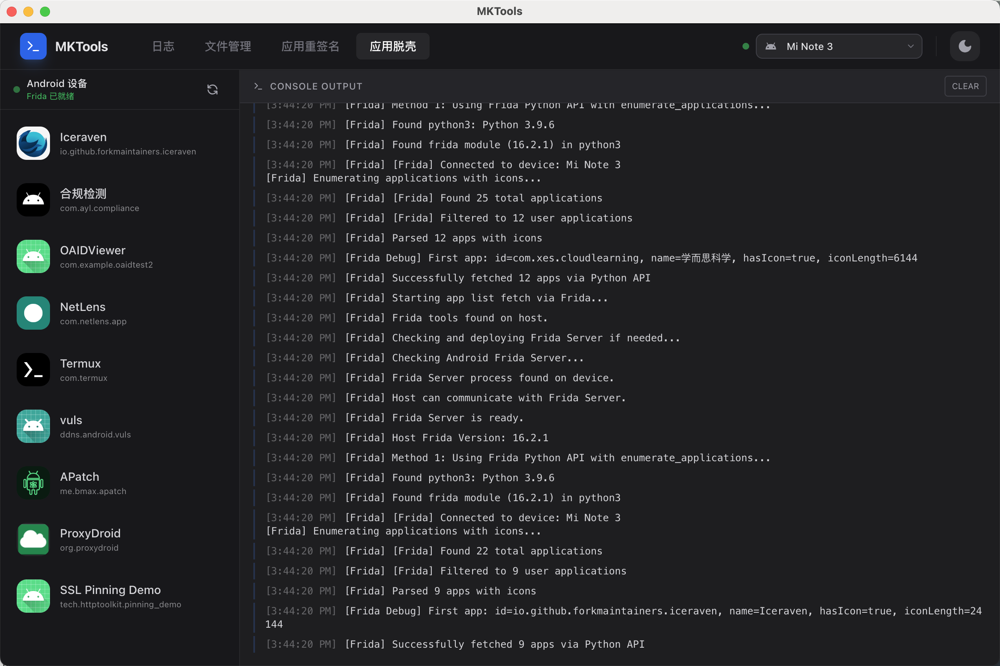

# MKTools

MKTools 是一款移动端应用分析工具箱(目前仅适配了Mac系统)。它集成了设备管理、日志查看、文件管理、应用签名和应用砸壳等功能，支持 Android 和 iOS 双平台，旨在简化日常开发和逆向分析工作流。

## ✨ 主要功能

### 1. 📱 多设备管理
- 自动检测并连接 USB 连接的 Android 和 iOS 设备。
- 实时显示设备状态和基本信息。
- 支持多设备切换操作。

### 2. 📝 日志查看器 (Log Viewer)
- **实时日志**: 实时捕获和显示 Android Logcat 和 iOS Syslog。
- **高级过滤**: 支持按日志等级 (Verbose, Debug, Info, Warn, Error)、Tag、PID 进行过滤。
- **搜索功能**: 支持关键词高亮搜索。
- **自动滚动**: 控制日志视图跟随最新输出。


### 3. 📂 文件管理 (File Manager)
- **文件浏览**: 可视化浏览设备文件系统。
- **文件操作**: 支持文件的上传、下载、删除、重命名、新建文件夹等操作。



### 4. 🔐 应用签名 (App Signer)
- **Android 签名**:
  - 支持 APK v1/v2/v3 签名。
  - 支持加载 Keystore 文件，自动解析和选择 Alias。
- **iOS 重签名** (适配中):
  - 支持 IPA 文件重签名。
  - 支持选择本地 Provisioning Profile 和开发者证书。



### 5. 🔓 应用砸壳 (App Decrypt)
- **基于 Frida**: 内置 Frida 引擎，安全高效。
- **一键脱壳**:
  - **Android**: 基于 `frida-dexdump`，支持从内存中 dump dex 文件。
  - **iOS**: 基于 `frida-ios-dump`，支持一键砸壳并导出无加密 IPA。
- **应用列表**: 自动加载设备内已安装应用列表（带图标），方便选择目标应用。



## 🛠️ 技术栈

- **Frontend**: React, TypeScript, TailwindCSS, Vite
- **Backend**: Electron
- **Tools**: Frida, ADB, Apktool, libimobiledevice

## 🏗️ 架构说明

本项目采用了多架构二进制打包策略，以确保在 Intel Mac (x64) 和 Apple Silicon Mac (arm64) 上均能原生运行，无需 Rosetta 转译（dsdump 等工具除外，已内置 Universal Binary 或自动适配）。

- **resources/bin/mac-arm64**: 存放 Apple Silicon 架构的原生工具 (adb, libimobiledevice 等)。
- **resources/bin/mac-x64**: 存放 Intel 架构的原生工具。
- **动态调用**: 程序启动时会自动识别系统架构 (`process.arch`) 并调用对应的工具目录。

## 🚀 快速开始

### 环境要求
- Node.js (建议 v18+)
- npm 或 yarn
- Python 3 (用于 Frida 脚本)
- Frida (Frida 版本16.2.1)
- Java (用于 Apktool 等工具)

### 安装依赖

```bash
npm install
```

### 开发模式启动

常规启动：
```bash
npm run dev
```

macOS 开发模式（修复应用名称显示）：
```bash
npm run dev:mac
```

### 构建安装包

```bash
npm run build
```

构建产物将位于 `dist_build` 目录中。

## 📖 文档与资源

本项目包含详细的 Frida 使用指南，位于 `docs/` 目录下：

- [Frida 脱壳指南](docs/FRIDA_DECRYPT.md)
- [Frida 示例脚本](docs/FRIDA_EXAMPLES.md)
- [Frida 快速参考](docs/FRIDA_QUICK_REFERENCE.md)
- [测试指南](docs/TESTING_GUIDE.md)

## ⚠️ 注意事项

- **iOS 功能**: 部分 iOS 功能（如砸壳）需要设备越狱并安装 Frida Server。
- **Android 功能**: 请确保已开启 USB 调试模式，砸壳功能建议在 Root 设备上使用以获得最佳兼容性。


本项目仅供学习和研究使用。
